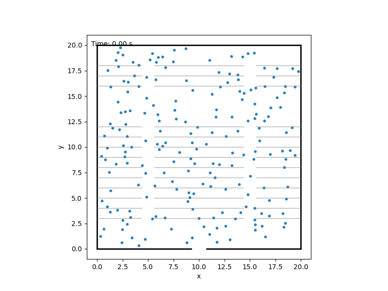

# Crowd Evacuation Simulation – Simon Theatre E


This project studies how congestion emerges near a single bottleneck during
evacuation using a simple 2D agent-based social-force-style model. The current
`main` branch keeps a deliberately clean baseline:

- single room
- single exit on the bottom wall
- 2D dynamics only
- one default soft repulsion model
- no corridor, no slope field, no multiple exits

The goal is not to build a large pedestrian framework. The goal is to produce a
poster-ready analysis pipeline for the onset of congestion in a bottleneck
evacuation system.

## Project Structure

- `main.py`: simple entry point for a single run or a small parameter scan
- `simulation.py`: simulation engine and run-level observables
- `repulsion.py`: baseline soft-repulsion force
- `analysis.py`: repeated runs, parameter scans, and onset-of-congestion estimate
- `visualization.py`: single-run and scan plotting utilities
- `requirements.txt`: Python dependencies

## What Is Measured

Each simulation run now records:

- evacuation time `T_evac`
- people remaining as a function of time
- cumulative evacuated count
- per-step outflow and time-binned outflow
- average evacuation flux `Q = N / T_evac` for completed runs
- local door density measured in a rectangular observation region above the exit
- clogging fraction

The local density is measured by counting active agents in a fixed box above the
door and dividing by its area.

The clogging indicator is intentionally simple:

- the main congestion/clogging state is defined by high local door density
- a stricter stalled indicator additionally requires low outflow in the same
  time bin

This is interpreted as a transparent, poster-friendly indicator of temporary
congestion rather than as a sophisticated traffic-state classifier.

## Transition-Like Analysis

The code includes a modest onset-of-congestion estimate for scans over crowd
size or global density. It does not claim a rigorous thermodynamic phase
transition.

Instead, it looks for practical crossover indicators such as:

- the first clearly non-zero clogging fraction
- the first sharp rise in evacuation time
- the crowd size or density where the average flux reaches a maximum

These are used as finite-size, transition-like markers for the onset of
stronger congestion near the bottleneck.

## Recent Changes

Recent changes on the current branch:

- the baseline single-room, single-exit model has been preserved
- run-level observables were added to support physics analysis
- local bottleneck density and a simple clogging indicator were added
- `analysis.py` was added for repeated runs and parameter scans
- plotting was extended to include both single-run and scan-based figures
- `main.py` now supports a single run plus simple scan modes while staying small

## Installation

```bash
python3 -m venv .venv
source .venv/bin/activate
pip install -r requirements.txt
```

## Run

Single simulation:

```bash
python main.py
```

Crowd-size / density scan:

```bash
python main.py --mode density-scan --repeats 4
```

Door-width scan:

```bash
python main.py --mode door-scan --repeats 4
```

Desired-speed scan:

```bash
python main.py --mode speed-scan --repeats 4
```

The default scan values are defined near the top of `main.py` and can be edited
directly for poster figures.
